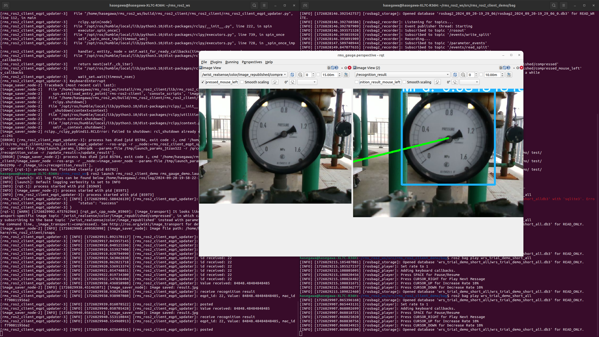

# RMS_ROS2_WS
WRS2024プレ大会にて点検データをRMSクラウドにアップロードするためのROS2テストワークスペース。<br>


# 動作環境
- Ubuntu 22.04
- ROS2 Humble

# インストール

```bash
source /opt/ros/humble/setup.bash
rosdep update
git clone git@github.com:Nexis-R/rms_ros2_ws.git ~/
cd rms_ros2_ws
rosdep install -r -y -i --from-paths .
```

# ROSBAGのインストール
rosbagの容量が大きすぎて管理が難しい為、今回は下記のgoogle driveにてrosbagファイルの管理を行う。<br>
https://drive.google.com/drive/folders/1NXrwgKcBzo4tS8Vbmvkx8UH2pP-ySmkc?usp=sharing
またgdownコマンドを使うと直接ダウンロードができる。

```bash
pip install gdown
cd ~/rms_ros2_ws/src/rms_ros2_client_demo/bag
gdown --folder https://drive.google.com/drive/folders/1NXrwgKcBzo4tS8Vbmvkx8UH2pP-ySmkc?usp=sharing
```

# ビルド
```bash
colcon build --symlink-install
source install/setup.bash
```

# 起動方法
## デモの起動 (ターミナル1)
以下のコマンドでデモを起動します。
```bash
ros2 launch rms_ros2_client_demo rms_gauge_demo.launch.py
```

##  データ再生 (ターミナル2)
デモ用のバッグファイルを再生します。
```bash
ros2 bag play wrs_trial_demo_short_all
```
rqtの映像が更新されない場合は、rqtをReloadすると映像が更新されます。

# 本家ROS1のRMS_WSとの仕様と異なる点（開発者向け）
- rms_gauge_demo.launch.pyで使用する為に最低限必要なノードのみを実装
- ros2 bagの再生をlaunchファイルには組み込まずに、ターミナル上で再生
- ３つに分かれていたrosbagを一つにまとめてwrs_trial_demo_short_allとした
- Rvizではなくrqtを使ってカメラ映像を確認できるようにした

# その他
バグ等などがあればissueを立ててください。プルリクも大歓迎です。
